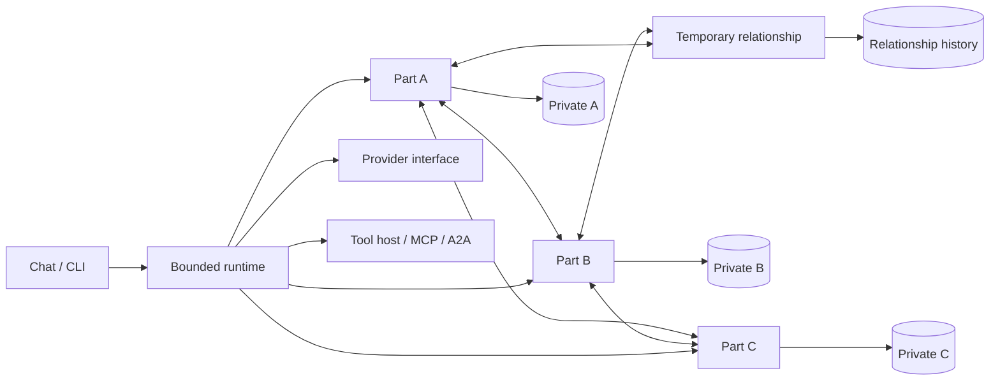

# Architecture

Kuru's native unit is a persistent part in a pool of equal actors. A part owns
its history and can send messages to any active peer. There is no LLM that
owns, directs or summarizes every other model call. The runtime decides when
mailboxes run and enforces resource limits mechanically.

The diagram shows data ownership and routing. The runtime invokes the provider
for each selected actor; actors are logical Tokio tasks backed by model calls,
not separate pretrained models or proof of distinct subjective experience.

## Frameworks

Built-in frameworks establish named roles, instructions and initial membership.
IFS includes Self, managers, firefighters and exiles. The polyvagal mode uses
modeled autonomic states; Freud uses id, ego and superego; Jung uses its own
archetypal roles. These are software interpretations rather than scientific
validation of a framework. A role's instructions influence what it notices and
proposes, without granting it authority over other actors.

Stable IDs identify parts. Switching a mode selects a different topology;
provider/model/effort are independent configuration choices. Adding a framework
belongs in `kuru-core`, keeping provider code unchanged.

## Peer and relationship state

Every actor receives its own private history and the context explicitly made
available by the session. Other actors' private histories are not combined in
its prompt. The shared user conversation is a separate namespace. Model
reports of feelings or intentions are recorded as modeled state.

Protection, polarization and alliance relationships contain two to four
unique active members. Canonical relationship IDs are independent of member
ordering. A relationship can become the speaking identity and retain its own
history after it stops speaking. Nonmembers have no implicit access to that
history. Being a member of a relationship does not merge the members' private
memories.

SQLite persists namespaces transactionally. Project identity derives from a
canonical path hash; state lives in a user data location outside tool roots.
Jungian collective memory is project-scoped in v1. A future explicit policy can
add cross-project scope without treating all user projects as one memory.

## Dreaming

Dreaming solicits bounded proposals from parts using their isolated context.
The runtime validates proposed additions and retirements, enforces `max_parts`
and preserves at least one active part for each role. Retired parts are archived;
their memories are retained. Saved prior topology permits undo. Explicit,
periodic and session-end triggers share the same validation path.

Dreaming is a consolidation and topology-update mechanism. It does not run an
unbounded background loop or imply biological sleep. Its provider calls count
toward the operational cost of a session.

## Extension boundaries

| Boundary | Adding a capability |
| --- | --- |
| `Config` and validation | Add a typed option, default, validation and layered-config test |
| `Framework` | Add roles/instructions and topology invariants |
| `Provider` | Implement dynamic `models` and normalized `complete` |
| `ToolHost` | Add a schema and bounded execution handler with permission checks |
| Protocol adapters | Translate MCP/A2A messages at the boundary |
| Runtime envelopes | Extend peer actions and validate them before mutating state |
| TUI/CLI | Expose options while keeping cognitive policy in the runtime |

A provider only performs inference. Codex authentication and app-server are
transports; Kuru owns actor context, memory and tools. General-purpose worker
subtrees are outside the initial architecture. A2A ingress/egress provides the
path to external peers, with explicit configured endpoints rather than remote
autodiscovery or implicit trust.

## Bounds and permissions

Concurrency, peer rounds and tool-call budgets bound cyclic conversation.
Cancellation terminates pending work. File read/list operations are available
within the root; mutations require write opt-in. Shell execution requires a
separate opt-in and is ordinary process authority. A working directory is not
a security sandbox. MCP servers and configured external endpoints are trusted
extensions and can have their own authority beyond Kuru's built-in file tools.
