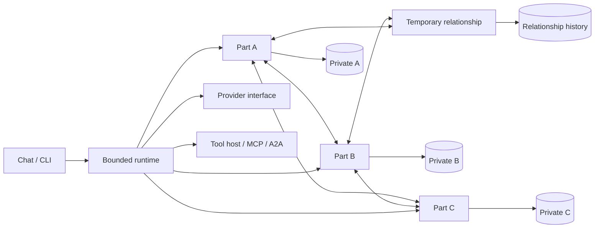

# Architecture

Kuru's native unit is a persistent part in a pool of equal actors. A part owns
its history and can send messages to any active peer. There is no LLM that
owns, directs or summarizes every other model call. The runtime decides when
mailboxes run and enforces resource limits mechanically.

```mermaid
flowchart LR
    U[Chat / CLI] --> R[Bounded runtime]
    R --> A[Part A]
    R --> B[Part B]
    R --> C[Part C]
    A <--> B
    B <--> C
    C <--> A
    A --> MA[(Private A)]
    B --> MB[(Private B)]
    C --> MC[(Private C)]
    A <--> G[Temporary relationship]
    B <--> G
    G --> MG[(Relationship history)]
    R --> P[Provider interface]
    R --> T[Tool host / MCP / A2A]
```

The diagram shows data ownership and routing. The runtime invokes the provider
for each selected actor; actors are logical Tokio tasks backed by model calls,
not separate pretrained models or proof of distinct subjective experience.

## Frameworks

Built-in frameworks establish named roles, instructions and initial membership.
IFS includes Self, managers, firefighters and exiles. The polyvagal mode uses
modeled autonomic states; Freud uses id, ego and superego; Jung uses its own
archetypal roles. These are software interpretations rather than scientific
validation of a framework. A role's instructions influence what it notices and
proposes, without granting it authority over other actors.

Stable IDs identify parts. Switching a mode selects a different topology;
provider/model/effort are independent configuration choices. Adding a framework
belongs in `kuru-core`, keeping provider code unchanged.

Core defines each built-in mode as a validated reference profile with six
separable, pure decision components: roles (seeds and coverage), peering
(eligible edges and relationships), flow (recipients and contribution envelopes),
facing (speaker choice), visibility (admitted context sources), and memory
(namespace keys and dream consolidation plan). These components return decisions;
the runtime still checks live identities and isolation, enforces budgets and tool
permissions, owns candidate memory, and performs every provider or tool call.
The engine consumes roles, peering, flow and facing at their execution boundaries:
roles supply fresh members and required-role checks; peering admits direct
messages and relationship proposals; flow selects pending recipients,
consultations and shared drafts; facing chooses the speaking identity. The
runtime validates those decisions against live identities, actual pending input
and the caller's target before acting. Selecting a peer grants no extra tool
authority. A mode change publishes its profile together with the configuration,
session and selected topology after the mode checkpoint settles and an absent
destination membership is initialized. A refused checkpoint leaves membership
and the selected live mode unchanged.

Visibility selects an actor's optional context before any of those sources are
read and gates peer delivery alongside peering. The selected sources feed the
same request-fit estimate used before inference. Current input, required tool
receipts and native continuation remain mandatory; omitting older context does
not delete it. Relationship actors use their own private namespace and explicitly
shared contributions.

The request builder puts common Kuru rules and reviewed project instructions
before the speaking actor's identity, phase and changing public transcript.
The runtime marks the byte boundary after common instructions. The native ChatGPT
connector renders shared and actor-local instructions as separate developer text
blocks and supplies a cache routing key derived from the shared instructions,
the actually offered tool schemas, model and effort. Changing private context or
actor identity does not change that key; different phase tool inventories retain
separate keys. The native endpoint rejects the API's explicit cache-breakpoint
field, so Kuru does not send it. API-key requests and callers without a boundary
keep their existing wire shape. Tool schemas use a stable order. Cache reuse is
opportunistic and depends on the selected model and service. Kuru records cache use
only when the provider reports cached input; a matching prefix alone is not a
cache-hit claim.

Memory selects checked identity namespaces, transcript and state keys, and each
dream's consolidation plan. The runtime validates those paths against the actual
project and identity before use. Actor tasks follow the namespace of the
published profile, including after mode changes and reconciliation. The four
existing modes retain their behavior and namespace layout; the policy boundary
adds no mode or user control.

Speaker selection preserves stronger runtime evidence before consulting a
framework's authored order. An explicit caller target wins first, followed by an
existing active runtime focus. Otherwise the greatest activation narrows the
eligible candidates; if the previous completed speaker remains in an equal
maximum, that continuity wins. Only a remaining tie consults the built-in order.
The first eligible authored identity is Self for IFS, Connection for polyvagal,
Desire for Freudian and Continuity for Jungian, with missing or ineligible
identities skipped in favor of the next authored member. The selection event
records `mode-authored-order`. If none of the tied eligible candidates belongs to
the built-in authored list, including a dream-only tie, stable ID order decides
and the event records `stable-id-order`. These are deterministic tie-break
reasons for the current turn; they grant no identity authority or supervisory
role over its peers.

## Peer and relationship state

Every actor receives its own private history and the context explicitly made
available by the session. Other actors' private histories are not combined in
its prompt. The shared user conversation is a separate namespace. Model
reports of feelings or intentions are recorded as modeled state.

Membership and relationships are shared within a project and framework. Each
identity has its own modeled-state row; the last accepted report for that
identity wins without rewriting other reports. Focus belongs to its session.
A retired focus is cleared when that session next loads current membership and
is saved by its next checkpoint. Retained and archived reports remain available
through the public topology view. A coherent batch or immutable revision read
cut loads these records without imposing a new graph-size limit.

Protection, polarization and alliance relationships contain two to four
unique active members. Canonical relationship IDs are independent of member
ordering. A relationship can become the speaking identity and retain its own
history after it stops speaking. Nonmembers have no implicit access to that
history. Being a member of a relationship does not merge the members' private
memories.

Dolt persists namespaces in versioned transactions. Project identity derives from a
canonical path hash; state lives in a user data location outside tool roots.
Jungian collective memory is project-scoped in v1. A future explicit policy can
add cross-project scope without treating all user projects as one memory.

Each admitted turn writes one user transcript row together with a session-scoped
journal entry. A local CLI or TUI admission also replaces the session's single
last-submission reference with that turn's exact ID, prompt and target. Before
actor work, the runtime records that external dispatch is possible. A completed
answer, its assistant row and the matching session state, including focus, commit
together. An interrupted outcome instead commits one fixed internal-role
transcript marker; that role is visible as a Kuru marker but excluded from model
conversation context.

Different sessions can drive the same project memory owner concurrently. Each
Harness has its own authenticated driver identity and dedicated presence
connection. The owner checks a session claim under the same guard as private
history and lifecycle writes. Selection checks the complete captured catalog and
old claim before transferring ownership; refusal retains the previous session.
Unknown selection outcomes fence local publication and dispatch until exact
handler recovery resolves them.

A checked native session lease remains held through admitted work and locally
owned cleanup, including after presence EOF or memory-owner restart. An old
driver therefore cannot overlap a replacement while draining. Ownership loss
cancels further dispatch and requires explicit checked existing-store admission
before private context resumes. This provides local exclusion, not rollback of
accepted external effects. Presence and final-client retirement follow actual
connection lifetime, without an idle timer or durable live-registration schema.

Turn-journal rows are durable no-expiry safety and idempotency history. Their
storage grows in proportion to admitted turns, and completed `TurnOutput` data is
retained indefinitely for exact retry. This intentionally duplicates some data
from the assistant transcript even though response events omit the answer body.
The journal has no aggregate cap, TTL or automatic deletion. It is separate from
the bounded operational diagnostics ring.

## Dreaming

Dreaming solicits bounded proposals from parts using their isolated context.
The runtime validates proposed additions and retirements, enforces `max_parts`
and preserves at least one active part for each role. Retired parts are archived;
their memories are retained. Saved prior membership permits undo. Explicit,
periodic and session-end triggers share the same validation path.

Each dream runs on a candidate branch, including its actor histories, summaries,
tool receipts and proposed membership. The candidate's coherent membership is
read before proposal inference; its writes do not change session focus or live
modeled-state reports. The project service serializes dream writers through its
owned lease, including inference and recovery; ordinary memory writes do not hold
that lease. If live memory advances, the runtime reconciles the exact captured
live revision into the private candidate before checked fast-forward promotion.
An independently advanced membership token conflicts when the dream also changed
that membership, even if the resulting row values are identical. Reports, session
rows and nonoverlapping histories remain intact. The retained retry count bounds
reconciliation to three attempts without repeating inference.
An accepted merge or promotion may finish after cancellation; exact branch/head/
live evidence settles it before further writes. Recovery checks the new effective
base and rebinds the checked main successor before publishing shared state. Undo
uses the same dream lease and adds a new
revision restoring membership while retaining later conversations, modeled-state
reports and choices. Historical full-topology undo records remain readable, but
their old focus and reports are not restored.
`kuru-memory` owns branch-pinned SQL views, verified engine installation and the
authenticated local sidecar. A lifetime supervisor reaps the sidecar on exit or
writer crash. No database process becomes a cognitive supervisor.

Dreaming is a consolidation and topology-update mechanism. It does not run an
unbounded background loop or imply biological sleep. Its provider calls count
toward the operational cost of a session.

The memory policy selects dream participants from the current active parts,
along with the prompt, descriptive phase and a proposal limit of at most two per
part. The runtime validates that plan before creating a candidate, preserves its
participant/result order under the existing parallel budget, and retains typed
Dream accounting. Candidate writes, promotion, cancellation, retirement checks
and compensating undo remain runtime-owned.

## Context and usage accounting

Runtime assigns each provider invocation an identity and admits it durably before
inference. The actor awaits usage writes through the fallible provider stream and
records success, failure or cancellation separately from reported token counts.
Missing reports remain incomplete. The memory package keeps these operational
records on a permanent project-owned Dolt branch, outside live and candidate
history. Usage commits cannot invalidate a dream's promotion base or disappear
with an abandoned candidate. Session totals are folded from invocation records;
there is no independently mutable total to replay twice.

Context assembly inventories optional history separately from mandatory
instructions, current input and tool receipts. It can omit whole older rows
without changing storage. Connectors check the actual serialized request,
including actor-private native continuation, immediately before dispatch.
Only non-content measurements leave that boundary. The status and `/cost`
projections distinguish estimates, known reports and incomplete history.

## Message representation

Core messages carry a role and ordered content blocks. Text, tool uses and tool
results retain their order and call identities; completions carry usage and
stop metadata separately. Text displayed by the current CLI and TUI is a
projection of that content, not a second mutable copy. The final `TurnOutput`
remains authoritative, including when a completed turn is retried.

Reasoning-summary, image and cache-boundary types establish a shared data
contract. They do not enable image input, visible token streaming, new reasoning
history capture or prompt-cache optimization. Native encrypted reasoning used
to continue a tool round remains transient and scoped to its actor. It is not
written into conversation memory or exposed by inspection.

## Extension boundaries

| Boundary | Adding a capability |
| --- | --- |
| `Config` and validation | Add a typed option, default, validation and layered-config test |
| `ModeProfile` | Define pure roles, peering, flow, facing, visibility and memory decisions within runtime invariants |
| `Provider` | Implement dynamic `models` and normalized `complete` |
| `ToolHost` | Add a schema and bounded execution handler with permission checks |
| Protocol adapters | Translate MCP/A2A messages at the boundary |
| Runtime envelopes | Extend peer actions and validate them before mutating state |
| TUI/CLI | Expose options while keeping cognitive policy in the runtime |

A provider only performs inference. The connector package owns native OpenAI
authentication, Kuru's private token store and direct HTTP transports. The
`codex` provider uses ChatGPT subscription access; `responses` uses an explicitly
selected API-key route. Neither launches an external Codex harness. Kuru owns
actor context, memory and tools. General-purpose worker subtrees are outside
the initial architecture. A2A ingress/egress provides the
path to external peers, with explicit configured endpoints rather than remote
autodiscovery or implicit trust.

## Bounds and permissions

Concurrency, peer rounds and tool-call budgets bound cyclic conversation.
Cancellation is an explicit signal through actor, provider, tool, A2A and dream
waits. Accepted memory writes still settle or reconcile, and shell or MCP owners
keep responsibility for their process cleanup. After workspace trust, core
permission rules select allow, ask or deny. The connector service checks the
validated invocation at native/MCP execution and before runtime outbound A2A.
Explicit deny always wins; an unresolved ask without a foreground approval
channel returns a typed refusal. The app owns private persistent grant files;
session grants live only in the running session, and once decisions remain
bound to one invocation. No approval channel is inherited by background work.

File tools retain root containment and protected-path checks regardless of
grants. Shell execution is ordinary process authority. A working directory is
not a security sandbox. MCP servers and configured external endpoints can have
their own authority beyond Kuru's built-in file tools. See
[tool permissions](configuration.md#tool-permissions) for rule precedence and
approval scopes.
